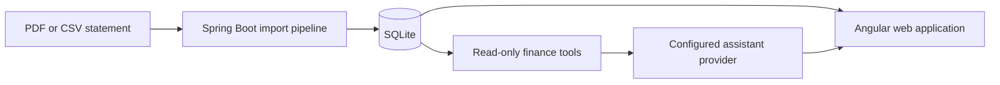

# Personal Finance Tracker

A local-first full-stack finance application that turns bank and credit-card statements into an inspectable personal ledger, account view, spending dashboard, and local AI assistant.

## Why this project exists

The application is built in layers: first make statement imports and financial calculations correct, then automate repetitive work, then add AI only where it can reason over verified data. The AI assistant never becomes the source of truth; it asks controlled tools for data from the application.

## Repository layout

```text
personal-finance-tracker/
├── AGENTS.md                  # Guidance for coding agents
├── README.md                  # Project entry point and setup
├── docs/                      # Architecture, flows, decisions, specifications
├── backend/                   # Java 21 + Spring Boot + SQLite
├── frontend/                  # Angular 22 web application
├── infrastructure/            # Future deployment notes; no cloud stack yet
└── scripts/                   # Future repeatable developer operations
```

## How it works



1. A statement is uploaded manually or placed in the watched local incoming folder.
2. The backend identifies the institution/account and uses a bank-specific parser where supported.
3. Transactions and account/statement metadata are normalized, deduplicated, categorized, and reviewed or confirmed.
4. SQLite persists the trusted ledger and statement snapshots.
5. Accounts, Transactions, Dashboard, and Notifications are projections over that trusted data.
6. The Assistant uses approved read-only finance tools; it never receives direct database access.

## Current capabilities

- PDF/CSV imports for supported American Express, Bank of America, Discover, and Wells Fargo statement layouts.
- Automatic account matching/creation, duplicate handling, transfer recognition, merchant normalization, and remembered category rules.
- Watched-folder statement imports with local archive handling.
- Account balances, card terms, statement activity, utilization, and historical snapshots.
- Transaction search and filtering, Dashboard summaries/trends, merchant spending, recurring detection, and reminders.
- Local LM Studio AI Assistant with structured tool calling and visible data-used evidence.
- Opt-in Amazon Bedrock Runtime adapter for Claude Haiku 4.5 and other Converse-compatible models; finance tools remain local and read-only.

## Run locally

### Backend

```powershell
cd backend
mvn spring-boot:run
```

The API runs at `http://localhost:8080`. SQLite data is intentionally local at `backend/data/finance-tracker.db` and is ignored by Git.

### Frontend

```powershell
cd frontend
npm install
npm start
```

Open `http://localhost:4200`.

### Local AI Assistant

1. Load a tool-capable model in LM Studio.
2. Start its Developer server, normally at `http://localhost:1234`.
3. Start the backend and frontend.
4. Open `/assistant` and ask a question.

The default model connection can be overridden with `LM_STUDIO_BASE_URL`, `LM_STUDIO_MODEL`, and `LM_STUDIO_API_KEY`. Do not put keys in source code.

### Amazon Bedrock Assistant (opt-in)

The default remains LM Studio. To use the Bedrock Runtime adapter, grant the local AWS identity permission to invoke an approved model, then start the backend with a local AWS profile:

```powershell
$env:FINANCE_ASSISTANT_PROVIDER = "bedrock"
$env:FINANCE_ASSISTANT_MODEL = "global.anthropic.claude-haiku-4-5-20251001-v1:0"
$env:AWS_PROFILE = "finance-tracker-bedrock"
cd backend
mvn spring-boot:run
```

The service uses the standard AWS credential chain; it does not store an access key, statement, database, or account number in application configuration. Bedrock receives only the question, approved tool definitions, and compact tool results needed for the answer. GPT-5.6 Luna uses Bedrock's separate OpenAI Responses interface and will be evaluated through a dedicated adapter after this first Converse-compatible provider is proven.

## Verify changes

```powershell
cd backend; mvn test
cd frontend; npm run build
```

## Documentation map

- [Architecture](docs/ARCHITECTURE.md) — components, boundaries, and data ownership.
- [Request flows](docs/REQUEST_FLOWS.md) — imports, automation, and assistant lifecycle.
- [Design decisions](docs/DESIGN_DECISIONS.md) — why the stack and safety rules were selected.
- [V1 implementation specification](docs/V1_IMPLEMENTATION_SPECIFICATION.md) — original product scope.
- [V1 delivery](docs/V1_DELIVERY.md), [V1.5 delivery](docs/V1_5_DELIVERY.md), [V2 delivery](docs/V2_DELIVERY.md), and [V2.5 delivery](docs/V2_5_DELIVERY.md) — what each completed product layer delivered.
- [AI Assistant Architecture](docs/AI_ASSISTANT_ARCHITECTURE.md) — detailed V3 tool-calling design.
- [V3 delivery](docs/V3_DELIVERY.md) and [V4 agentic implementation plan](docs/V4_IMPLEMENTATION_PLAN.md) — local AI status and the controlled multi-step workflow now in progress.
- [V5 production-polish plan](docs/V5_PRODUCTION_POLISH_PLAN.md) — optional future hardening.
- [Development roadmap](docs/ROADMAP.md) — completed work and next milestones.
