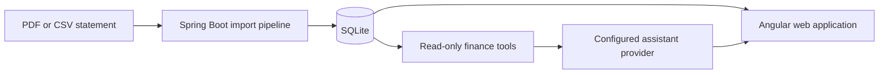

# Personal Finance Tracker

A local-first full-stack finance application that turns bank and credit-card statements into an inspectable personal ledger, account view, spending dashboard, and local AI assistant.

## Why this project exists

The application is built in layers: first make statement imports and financial calculations correct, then automate repetitive work, then add AI only where it can reason over verified data. The AI assistant never becomes the source of truth; it asks controlled tools for data from the application.

## Repository layout

```text
personal-finance-tracker/
├── AGENTS.md                  # Guidance for coding agents
├── README.md                  # Project entry point and setup
├── docs/                      # Architecture, flows, decisions, specifications
├── backend/                   # Java 21 + Spring Boot + SQLite
├── frontend/                  # Angular 22 web application
├── infrastructure/            # Future deployment notes; no cloud stack yet
└── scripts/                   # Future repeatable developer operations
```

## How it works


```mermaid
flowchart LR
    S[PDF or CSV statement] --> I[Spring Boot import pipeline]
    I --> D[(SQLite)]
    D --> W[Angular web application]
    D --> T[Read-only finance tools]
    T --> A[Configured assistant provider]
    A --> W
```

1. A statement is uploaded manually or placed in the watched local incoming folder.
2. The backend identifies the institution/account and uses a bank-specific parser where supported.
3. Transactions and account/statement metadata are normalized, deduplicated, categorized, and reviewed or confirmed.
4. SQLite persists the trusted ledger and statement snapshots.
5. Accounts, Transactions, Dashboard, and Notifications are projections over that trusted data.
6. The Assistant uses approved read-only finance tools; it never receives direct database access.

The Imports page is deliberately organized around two grids: a year-selectable statement-coverage view and filterable import history. A green coverage check means a saved statement is associated with that account and month; a red cross means no statement exists after the account's first observed statement month. A neutral dash avoids treating months before the app first saw that account as missing. Manual upload is available from a compact dialog, while the watched-folder path remains a brief local-use hint.

## Current capabilities

- PDF/CSV imports for supported American Express, Bank of America, Bilt Blue card statements and activity exports, Discover, and Wells Fargo statement layouts.
- An Imports coverage matrix by account and calendar month. It derives coverage from saved statement-cycle dates (or transaction/import date fallback), marks months before the first observed statement as not expected, and makes genuinely missing saved months visible.
- Automatic account matching/creation, duplicate handling, transfer recognition, merchant normalization, and remembered category rules.
- Watched-folder statement imports with local archive handling.
- Account balances, card terms, statement activity, utilization, and historical snapshots.
- Transaction search and filtering, Dashboard summaries/trends, merchant spending, recurring detection, and reminders.
- Local LM Studio AI Assistant with structured tool calling, automatic single-step versus multi-step routing, safely formatted answers, and visible data-used evidence.
- Local, persistent Assistant conversations with backend-owned IDs, bounded session context, refresh restoration, and explicit deletion.
- Opt-in Amazon Bedrock Runtime adapter for Claude Haiku 4.5 and other Converse-compatible models; finance tools remain local and read-only.

## Run locally

### Backend

```powershell
cd backend
mvn spring-boot:run
```

The API runs at `http://localhost:8080`. SQLite data is intentionally local at `backend/data/finance-tracker.db` and is ignored by Git.

### Local logs

The backend writes rolling local logs to `backend/data/logs/finance-tracker.log` (14 days, capped at 100 MB). They record operational events such as provider errors and agent-run metadata, but deliberately exclude API keys, raw assistant questions, answers, statements, and transaction rows.

### Frontend

```powershell
cd frontend
npm install
npm start
```

Open `http://localhost:4200`.

### Local AI Assistant

1. Load a tool-capable model in LM Studio.
2. Start its Developer server, normally at `http://localhost:1234`.
3. Start the backend and frontend.
4. Open `/assistant` and ask a question.

The default model connection can be overridden with `LM_STUDIO_BASE_URL`, `LM_STUDIO_MODEL`, and `LM_STUDIO_API_KEY`. Do not put keys in source code.

### Amazon Bedrock Assistant (opt-in)

The default remains LM Studio. To use the Bedrock Runtime adapter, grant the local AWS identity permission to invoke an approved model, then start the backend with a local AWS profile:

```powershell
$env:FINANCE_ASSISTANT_PROVIDER = "bedrock"
$env:FINANCE_ASSISTANT_MODEL = "global.anthropic.claude-haiku-4-5-20251001-v1:0"
$env:AWS_PROFILE = "finance-tracker-bedrock"
cd backend
mvn spring-boot:run
```

The Runtime/Converse adapter uses the standard AWS credential chain; it does not store an access key, statement, database, or account number in application configuration. Bedrock receives only the question, approved tool definitions, and compact tool results needed for the answer. Mantle-only models, including Gemma 4 31B, use a separate OpenAI-compatible adapter with `AWS_BEARER_TOKEN_BEDROCK` (or the app alias `BEDROCK_API_KEY`). GPT-5.6 Luna uses Bedrock's separate OpenAI Responses interface and will be evaluated through its own adapter.

To evaluate Google Gemma 4 E2B through Mantle, set `FINANCE_ASSISTANT_MODEL=google.gemma-4-e2b`. The optional `BEDROCK_REASONING_EFFORT=high` setting is passed through only to Mantle requests and is recommended by AWS for this model.

The assistant reserves `1200` output tokens for its final explanation by default so reasoning-capable models can complete multi-part answers. Override this locally with `FINANCE_ASSISTANT_FINAL_ANSWER_MAX_TOKENS` when evaluating response length, latency, and cost. Tool-selection turns default to `160` tokens; when evaluating Gemma 4 E2B with high reasoning effort, use `FINANCE_ASSISTANT_TOOL_SELECTION_MAX_TOKENS=600` so it has enough room to reason and return a function call.

### Start script

Use the repository launcher instead of repeatedly setting environment variables by hand. It never saves credentials; set your Bedrock API key once in the current PowerShell session, then run:

```powershell
$env:AWS_BEARER_TOKEN_BEDROCK = "your-bedrock-api-key"
./scripts/start-backend.ps1
```

The defaults start Bedrock Mantle with `google.gemma-4-e2b`, high reasoning effort, a 600-token tool-selection allowance, and a 1200-token final-answer allowance. To preview the effective configuration without starting the server, use `./scripts/start-backend.ps1 -DryRun`. You can select another model without editing source code, for example `./scripts/start-backend.ps1 -Model google.gemma-4-31b -ReasoningEffort ''`.

### Spring AI LM Studio evaluation (V6, opt-in)

The established Assistant runtime remains the default. To evaluate the new Spring AI `ChatClient` path against a tool-capable model loaded in LM Studio, use:

```powershell
./scripts/start-backend.ps1 -Provider lm-studio -Runtime spring-ai-lm-studio -Model your-loaded-model-id
```

This enables Spring AI only for that process. It connects to LM Studio at `http://localhost:1234`, sends the same allow-listed read-only tools, and returns the same Assistant API shape and evidence. Stop the process and start normally (or use `-Runtime custom`) to return immediately to the proven V4 runtime. The Spring AI runtime remains an evaluation path until the V4 verification prompts pass with equivalent answers and tool traces.

### Spring AI Bedrock Converse evaluation (V6, opt-in)

Use Amazon Bedrock's native Converse API through Spring AI instead of the existing handwritten Bedrock adapter:

```powershell
$env:AWS_PROFILE = "finance-tracker-bedrock"
./scripts/start-backend.ps1 -Provider bedrock -Runtime spring-ai-bedrock
```

The launcher selects Claude Haiku 4.5's global inference profile by default for this runtime. Your selected local AWS identity needs `bedrock:InvokeModel` permission for that model or inference profile; no Bedrock API key is used or stored. This is an opt-in evaluation path and sends only the question, bounded conversation context, tool definitions, and the individual tool results needed for an answer—not the SQLite database or raw statements.

### Spring AI Gemma through Bedrock Mantle (V6, opt-in)

To retain the previously evaluated Gemma model while replacing the handwritten `RestClient` protocol code with Spring AI, use the Mantle-specific runtime:

```powershell
$env:AWS_BEARER_TOKEN_BEDROCK = "your-bedrock-mantle-api-key"
./scripts/start-backend.ps1 -Provider bedrock-mantle -Runtime spring-ai-bedrock-mantle
```

It defaults to `google.gemma-4-31b`. This path uses the same Bedrock Mantle OpenAI-compatible endpoint and session-only API token as the existing Gemma runtime; it does not use Bedrock Converse or require `bedrock:InvokeModel` IAM permission.

## Verify changes

```powershell
cd backend; mvn test
cd frontend; npm run build
```

## Documentation map

- [Architecture](docs/ARCHITECTURE.md) — components, boundaries, and data ownership.
- [Request flows](docs/REQUEST_FLOWS.md) — imports, automation, and assistant lifecycle.
- [Design decisions](docs/DESIGN_DECISIONS.md) — why the stack and safety rules were selected.
- [V1 implementation specification](docs/V1_IMPLEMENTATION_SPECIFICATION.md) — original product scope.
- [V1 delivery](docs/V1_DELIVERY.md), [V1.5 delivery](docs/V1_5_DELIVERY.md), [V2 delivery](docs/V2_DELIVERY.md), and [V2.5 delivery](docs/V2_5_DELIVERY.md) — what each completed product layer delivered.
- [AI Assistant Architecture](docs/AI_ASSISTANT_ARCHITECTURE.md) — detailed V3 tool-calling design.
- [V3 delivery](docs/V3_DELIVERY.md), [V4 delivery](docs/V4_DELIVERY.md), and [V4 agentic implementation plan](docs/V4_IMPLEMENTATION_PLAN.md) — local AI status, delivered agent safeguards, and the controlled multi-step workflow.
- [V5 production-polish plan](docs/V5_PRODUCTION_POLISH_PLAN.md) — optional future hardening.
- [V9 persistent-agent-memory plan](docs/V9_PERSISTENT_AGENT_MEMORY_PLAN.md) — backend-owned conversation history, safe bounded context, and retention design.
- [V10 explicit-memory plan](docs/V10_EXPLICIT_MEMORY_PLAN.md) — user-controlled durable Assistant preferences, separate from chat history and ledger data.
- [V6 Spring AI migration plan](docs/V6_SPRING_AI_MIGRATION_PLAN.md) — opt-in migration from handwritten provider calls to Spring AI while preserving the local, read-only tool boundary.
- [Development roadmap](docs/ROADMAP.md) — completed work and next milestones.
