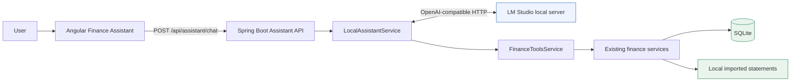
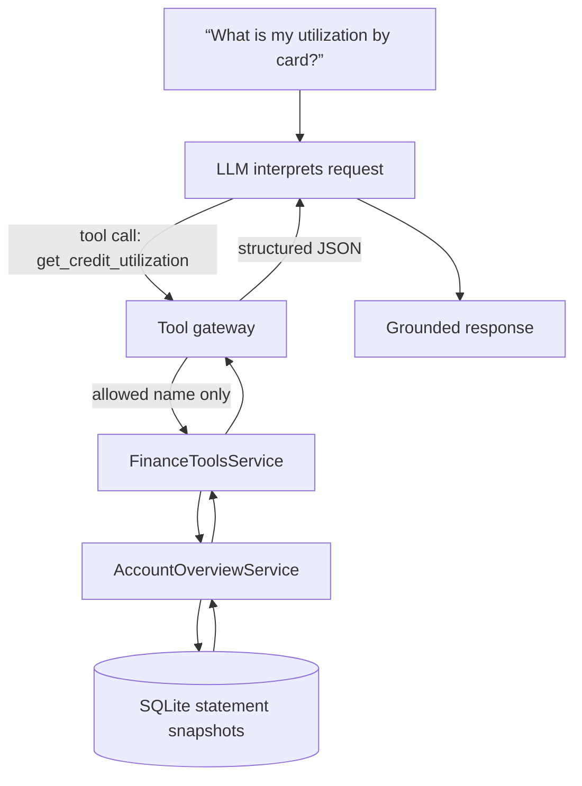
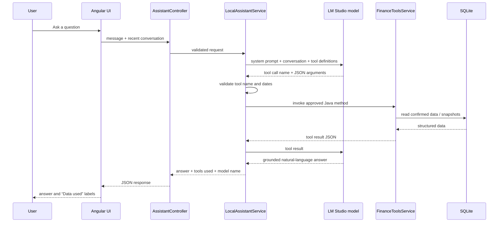
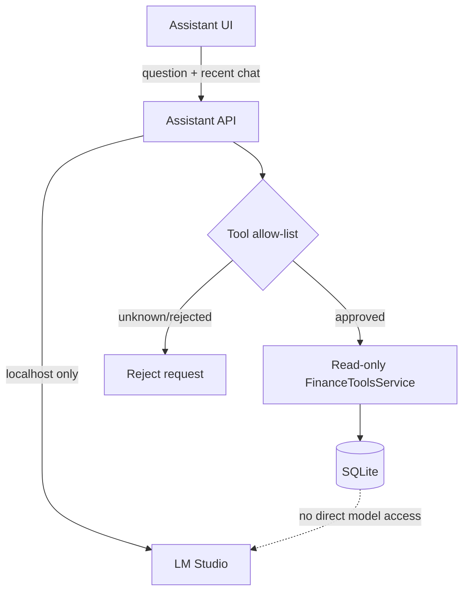
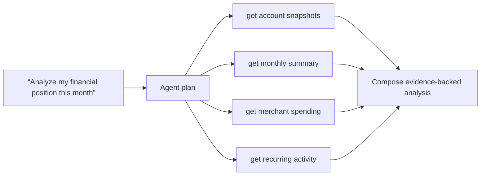

# Personal Finance Tracker — V3 AI Assistant Architecture

**Status:** implemented foundation; local LM Studio integration active  
**Primary implementation:** `backend/`  
**User interface:** `frontend/`  
**Data policy:** local-first and read-only in V3

## 1. Purpose

V3 adds a conversational interface to the Personal Finance Tracker. A person can ask questions such as:

- “How much did I spend by category last month?”
- “What is my credit utilization by each card?”
- “How much did I spend at Patel Brothers in July and August?”
- “What changed from last month?”

The assistant is **not** allowed to guess financial values. It must obtain financial facts from the application’s existing, structured data through specifically approved tools. The language model interprets the question and writes a clear explanation; Spring Boot owns data access, validation, calculations, and safety.

This distinction is the central design principle:

> The model is the conversational reasoning layer. The finance application remains the source of truth.

## 2. Goals and non-goals

### Goals

- Answer finance questions using confirmed, locally stored data.
- Let an LLM choose and combine only approved read-only capabilities.
- Make every answer traceable to the tools used.
- Work with a local model in LM Studio, without a cloud account or API key by default.
- Keep the tool layer provider-independent so a cloud LLM can be introduced later without changing finance logic.

### Explicit V3 non-goals

- No autonomous categorization changes, import changes, account edits, budget changes, or money movement.
- No unrestricted SQL, filesystem access, shell access, browser access, or arbitrary HTTP access for the model.
- No financial, tax, legal, or investment advice.
- No background autonomous agent that acts without a user question.
- No requirement for a vector database, embeddings, RAG, or an agent framework.

## 3. System context



All components normally run on the same computer:

| Component | Responsibility | Trust boundary |
|---|---|---|
| Angular UI | Captures the question, displays answer and data-used labels | Browser UI only |
| Assistant API | Validates request and returns a response | Application boundary |
| `LocalAssistantService` | Sends prompts, exposes tools, validates tool names, orchestrates tool calls | AI safety boundary |
| LM Studio | Local language model inference | Local model process |
| `FinanceToolsService` | Read-only, structured finance operations | Data access boundary |
| Existing domain services | Accounts, transactions, dashboards, recurring detection | Business logic boundary |
| SQLite / statements | Persisted source data | Source of truth |

## 4. Why tools are required

An LLM is good at interpreting a question and writing a response. It is not a reliable database, calculator, or ledger. Passing every transaction into a prompt would be slow, expensive for a cloud provider, difficult to audit, and likely to exceed context limits.

Tools solve that problem. A tool is a narrow backend function with:

1. A fixed name.
2. A description explaining when to use it.
3. A JSON input schema.
4. Server-side authorization and validation.
5. Structured output from the actual database/services.

For example, `get_credit_utilization` has no input. The model may request it, but cannot decide what SQL it runs. Spring Boot calculates utilization from saved statement snapshots and returns a controlled JSON result.



The deterministic calculation is therefore not “instead of AI.” It is the trustworthy evidence that makes an AI finance assistant possible.

## 5. Current V3 tool catalog

The public, provider-independent tool layer is exposed below `/api/finance-tools`. `LocalAssistantService` calls the same Java service directly; the HTTP endpoints also make each tool independently testable.

| Tool name presented to model | Backend operation | Purpose |
|---|---|---|
| `get_monthly_summary` | `FinanceToolsService.monthlySummary` | Income, expenses, remittance, cash flow, category totals |
| `get_category_spending` | `categorySpending` | Confirmed spending grouped by category |
| `get_merchant_spending` | `merchantSpending` | Top merchants plus prior-period comparison |
| `get_credit_utilization` | `creditUtilization` | Combined and per-card limits, balances, available credit, utilization |
| `get_recurring_activity` | `recurringActivity` | Confirmed repeating monthly patterns |
| `compare_periods` | `comparePeriods` | Two explicit period summaries |
| `search_transactions` | `searchTransactions` | Confirmed transactions filtered by account, date, category, or merchant |

All tools are read-only. Their methods call established services such as `DashboardService`, `AccountOverviewService`, `RecurringTransactionService`, and `TransactionService`; they do not expose raw SQL to the model.

## 6. Tool definition generation

LM Studio implements an OpenAI-compatible tool-calling protocol. Before requesting a completion, `LocalAssistantService.toolDefinitions()` constructs a list of JSON function definitions.

Conceptual example:

```json
{
  "type": "function",
  "function": {
    "name": "search_transactions",
    "description": "Find confirmed transactions by optional date range, account, category, or merchant.",
    "parameters": {
      "type": "object",
      "properties": {
        "accountId": { "type": "string" },
        "from": { "type": "string", "description": "Date in YYYY-MM-DD format" },
        "to": { "type": "string", "description": "Date in YYYY-MM-DD format" },
        "category": { "type": "string" },
        "merchant": { "type": "string" }
      }
    }
  }
}
```

The server, not the model, generates this catalog. The model cannot add a function name or modify a function’s privileges.

## 7. Standard LLM tool-calling workflow



### Step-by-step details

1. **Input:** Angular sends the current question and up to 12 recent user/assistant messages. The current question is required and validated with `@NotBlank`.
2. **System instruction:** Spring Boot adds a non-user-editable system prompt. It requires factual answers to use tools, prohibits invention, includes the current date, and explains date semantics such as “last month.”
3. **Tool listing:** Spring Boot sends the pre-built tool catalog to LM Studio’s `/v1/chat/completions` endpoint.
4. **Model decision:** The model either emits a text response or an OpenAI-style `tool_calls` array containing a tool name and JSON string arguments.
5. **Validation:** `LocalAssistantService.execute()` accepts only tool names in its `switch` statement. Unknown names return an error rather than being executed.
6. **Execution:** Java parses the arguments, validates dates, calls `FinanceToolsService`, and serializes the structured result to JSON.
7. **Second model call:** Spring Boot sends the tool result to the model with `role: tool` and the matching `tool_call_id`.
8. **Final answer:** The model explains the result. The backend returns the answer along with the exact tool names used, and the UI shows those names as evidence.

## 8. Direct reliability paths and the LLM-first target

### What was observed

The local Gemma model correctly called `get_credit_utilization` for a simple question. It was less consistent with relative dates (“last month”), missing prior conversation context, and questions whose initial tool result did not contain enough detail (“utilization by each card”).

This was not a database problem. It came from four integration realities:

1. The first UI request did not send prior conversation, so follow-up questions were stateless.
2. A phrase like “last month” has to be resolved relative to today before a date-sensitive operation can run.
3. The original utilization tool returned only an overall figure; the tool had to be expanded to include card-level detail.
4. Small local models can be less consistent at function selection and argument formation than larger, tool-tuned models.

### Current reliability support

For a small group of unambiguous, high-value questions, the service provides a direct, structured route before asking the model:

- overall or per-card credit utilization;
- spending by category for a named month or “last month”;
- merchant spending for a named merchant and period;
- simple “overall” follow-ups that refer to a previously named merchant.

These routes still use the same approved finance tools and return the tool name to the UI. They do not query data outside the application.

### Target steady-state design

The intended architecture remains **LLM-first**:

```mermaid
flowchart LR
    Q[Question] --> C[Conversation and date context]
    C --> L[LLM selects finance tool(s)]
    L --> V[Server validates request]
    V --> D[Deterministic finance data and calculations]
    D --> L
    L --> A[Grounded answer]
    V -.fallback only.-> F[Direct structured response]
```

This LLM-first route is implemented. `LocalAssistantService` sends the tool catalog to LM Studio before considering deterministic routing. A direct structured response is used only when the local model is unavailable, returns invalid tool arguments, or returns no tool call for a question the application can answer safely. The API reports `MODEL_TOOL_CALL`, `MODEL_RESPONSE`, or `FALLBACK` as `executionMode` so endpoint tests can verify the route used.

## 9. Conversation memory

V3 conversation is currently **client-session memory**, not a long-term database memory.

- The Angular Assistant page stores displayed messages in memory while the page is open.
- Each request includes the last 12 messages as `conversation`.
- Refreshing the page starts a new conversation.
- No chat transcript is persisted in SQLite in the current implementation.

This design is intentional for privacy and simplicity. A future enhancement could add an opt-in, encrypted local conversation history, but it is not required for correct finance answers.

## 10. Date interpretation

Finance questions often contain human dates rather than ISO dates. The assistant must make date behavior explicit and testable.

| User phrase | V3 interpretation |
|---|---|
| “last month” | Previous calendar month based on the machine date |
| “this month” | Current calendar month, when supported by the model/tool route |
| “July and August” | July 1 through August 31 of the current year unless a year is supplied |
| “overall” | All saved history for spending questions; current statement snapshot for utilization |
| Explicit dates | Parsed as ISO `YYYY-MM-DD` date values |

The system prompt includes the current date and last-month period. Direct reliability paths resolve common phrases in Java so calculations are reproducible.

## 11. Data semantics

Correct answers depend on business rules already implemented in the finance tracker:

- Dashboard spending uses **confirmed** transactions.
- Transfers are excluded from expenses and spending totals.
- India remittance is reported separately from ordinary expenses.
- Credit-card purchases use the card transaction sign convention; checking/savings purchases use the opposite sign convention. The tool layer normalizes these to positive spending.
- Credit utilization uses statement balance and credit limit snapshots, not transaction totals.
- Per-card and overall utilization comparisons require prior saved snapshots. Missing history is reported as unavailable rather than invented.
- Merchant matching uses normalized merchant names. It is intentionally distinct from the raw statement description.

## 12. API contracts

### UI to Spring Boot

```http
POST /api/assistant/chat
Content-Type: application/json
```

```json
{
  "message": "How much did I spend by category last month?",
  "conversation": [
    { "role": "user", "text": "How much did I spend at Patel Brothers?" },
    { "role": "assistant", "text": "You spent ..." }
  ]
}
```

### Spring Boot response

```json
{
  "answer": "Confirmed spending by category for 2026-08-01 through 2026-08-31: ...",
  "toolsUsed": ["get_category_spending"],
  "model": "gemma-4-e2b-it-qat"
}
```

`toolsUsed` is evidence for the user interface and an audit/debugging aid. It does not expose raw database credentials, SQL, or hidden system instructions.

## 13. LM Studio connection

The default development configuration is in `application.yaml`:

```yaml
finance:
  assistant:
    lm-studio:
      base-url: ${LM_STUDIO_BASE_URL:http://localhost:1234/v1}
      model: ${LM_STUDIO_MODEL:gemma-4-e2b-it-qat}
      api-key: ${LM_STUDIO_API_KEY:}
```

### Startup checklist

1. Open LM Studio.
2. Load a tool-capable local instruction model.
3. In the **Developer** tab, start the local server.
4. Confirm `GET http://localhost:1234/v1/models` returns the loaded model.
5. Start Spring Boot on port 8080.
6. Open `/assistant` in the Angular application.

LM Studio normally does not require a key for a server bound to `localhost`. If LM Studio authentication is enabled, provide `LM_STUDIO_API_KEY` as an environment variable; never commit the token to `application.yaml`, source files, or Git.

## 14. Security and privacy controls



Controls in V3:

- The model never receives database credentials or a database connection.
- The model cannot supply SQL, files, URLs, or executable commands to run.
- Only named methods in `LocalAssistantService.execute()` may run.
- Tool methods are read-only and use existing application business rules.
- The Angular UI labels the tools used for each response.
- LM Studio is configured locally by default; no finance data is sent to a cloud provider.
- API keys, if enabled, are environment configuration—not code or Git history.

Remaining considerations for later versions:

- Limit assistant request size and tool result size.
- Add per-request timeouts and cancellation.
- Add rate limits if the application is exposed beyond localhost.
- Add explicit user authorization before any future write-capable tool.
- Consider local encrypted conversation persistence only if there is a clear user need.

## 15. Testing and evaluation plan

### Unit and integration testing

Test each finance tool independently with fixture transactions and statement snapshots:

- correct category totals and exclusion of transfers;
- checking vs credit-card sign handling;
- no results for a date range;
- credit utilization with zero or missing limits;
- prior snapshot comparisons;
- merchant normalization and filtering;
- recurring activity with enough/not-enough history.

Test `LocalAssistantService` with a mocked LM Studio HTTP response for:

- a permitted tool call;
- an unknown tool name;
- malformed JSON arguments;
- an unavailable LM Studio server;
- empty model completion;
- a multi-tool request.

### Assistant evaluation questions

Maintain a small version-controlled evaluation set, for example:

| Question | Expected tool(s) | Expected behavior |
|---|---|---|
| “What is my current total credit utilization?” | `get_credit_utilization` | Return current total, limit, utilized balance |
| “Utilization by each card” | `get_credit_utilization` | Include every card snapshot |
| “How much did I spend by category last month?” | `get_category_spending` | Resolve exact prior calendar month |
| “What are my top merchants?” | `get_merchant_spending` | State selected/default period |
| “Compare August with July” | `compare_periods` | Use both explicit ranges |
| “How much at Patel Brothers in July and August?” | `search_transactions` | Normalize merchant and date range |
| “What recurring expenses do I have?” | `get_recurring_activity` | Explain insufficient history honestly when empty |

Record pass/fail results when changing model, system prompt, tools, or date-routing logic. This is how assistant quality improves without relying on anecdotes.

## 16. Model selection guidance

The current `gemma-4-e2b-it-qat` local model demonstrated basic OpenAI-compatible tool calls. It is appropriate for validating the architecture, but model size and tool-following behavior influence user experience.

When evaluating another local model, test:

1. Correct function selection.
2. Correct JSON arguments.
3. Follow-up context understanding.
4. Relative-date interpretation.
5. Honest handling of missing data.
6. Response latency on the user’s computer.
7. Ability to summarize multiple tool results without inventing facts.

Select the smallest model that passes the evaluation suite at an acceptable latency. A larger or explicitly tool-tuned model may reduce fallback use, but does not remove the need for deterministic data tools and validation.

## 17. V4 evolution

V4 builds on the same tool contracts. The difference is that the assistant may plan and use multiple tools in sequence, for example:



V4 should retain the V3 safety model: tools remain scoped, validation stays in Spring Boot, and any write operation requires specific user approval.

## 18. Implementation map

| File / area | Responsibility |
|---|---|
| `assistant/FinanceToolsService.java` | Provider-independent finance operations |
| `assistant/FinanceToolsController.java` | Independently testable read-only API |
| `assistant/LocalAssistantService.java` | LM Studio prompt, tool catalog, validation, orchestration, fallbacks |
| `assistant/AssistantController.java` | `/api/assistant/chat` endpoint |
| `assistant/AssistantChatRequest.java` | Validated UI request plus conversation context |
| `assistant/AssistantChatResponse.java` | Answer, tool evidence, model name |
| `application.yaml` | Local LM Studio base URL/model/key configuration |
| `frontend/src/app/assistant/` | Assistant page and chat UI |

## 19. Summary

The AI assistant is not a model with unrestricted access to personal finances. It is a controlled orchestration system:

```text
Natural-language question
→ local model interprets it
→ Spring Boot validates a limited tool request
→ application reads trusted local data
→ local model explains verified results
→ user sees answer and evidence
```

That architecture keeps the AI useful while preserving accuracy, privacy, maintainability, and a clear path from V3 assistant to V4 multi-step agent.
