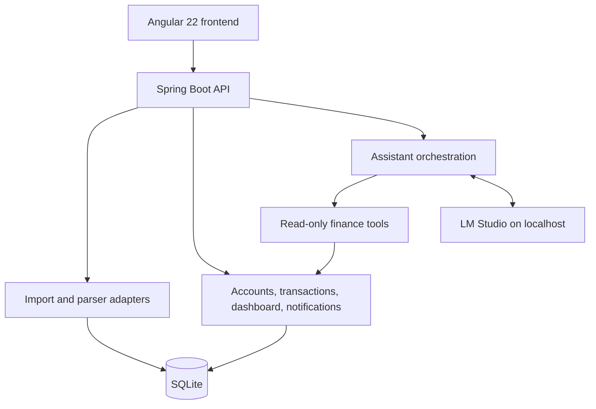

# System Architecture

## Overview



## Ownership boundaries

- **Frontend:** presentation, filters, review interactions, and in-page Assistant conversation context.
- **Backend:** statement parsing, persistence, financial calculations, data validation, API contracts, and AI tool authorization.
- **SQLite:** local ledger, accounts, imports, transactions, category mappings, and statement snapshots.
- **LM Studio:** interprets questions and explains tool results. It has no database or filesystem permission.

## Data lifecycle

```text
Statement file → parser adapter → normalized transaction/statement fields
→ account match → duplicate and transfer detection → category/review state
→ confirmed local ledger → dashboard/accounts/notifications/assistant tools
```

## Related documents

- [Request flows](REQUEST_FLOWS.md)
- [Design decisions](DESIGN_DECISIONS.md)
- [Detailed AI Assistant Architecture](AI_ASSISTANT_ARCHITECTURE.md)
