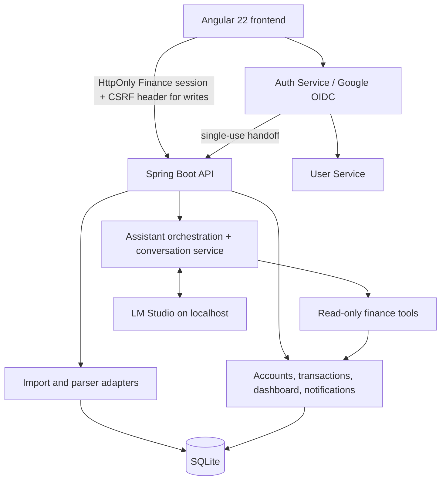

# System Architecture

## Overview


```mermaid
flowchart TB
    UI[Angular 22 frontend] -->|HttpOnly Finance session + CSRF header for writes| API[Spring Boot API]
    UI --> Auth[Auth Service / Google OIDC]
    Auth --> Users[User Service]
    Auth -->|single-use handoff| API
    API --> IMPORT[Import and parser adapters]
    API --> FINANCE[Accounts, transactions, dashboard, notifications]
    API --> ASSISTANT[Assistant orchestration + conversation service]
    IMPORT --> DB[(SQLite)]
    FINANCE --> DB
    ASSISTANT --> TOOLS[Read-only finance tools]
    TOOLS --> FINANCE
    ASSISTANT <--> LM[LM Studio on localhost]
```

## Ownership boundaries

- **Frontend:** presentation, filters, review interactions, and Assistant transcript rendering.
- **Backend:** statement parsing, persistence, financial calculations, data validation, API contracts, AI tool authorization, and bounded conversation-context assembly.
- **SQLite:** local ledger, accounts, imports, transactions, category mappings, statement snapshots, and local Assistant conversations/messages/session context.
- **LM Studio:** interprets questions and explains tool results. It has no database or filesystem permission.

## V7 ownership boundary

Finance Tracker is now a resource server behind the existing Auth Service. The User Service's stable internal user ID is `owner_user_id` on every user-owned finance and Assistant record. The request filter derives that owner only from a verified opaque Finance session; repositories apply it to reads and writes. Mutations also require a session-bound CSRF header, and credentialed CORS is limited to the configured Angular origin. Optional Plaid Items remain planned and will be encrypted and owner-scoped; neither the browser nor an Assistant model will receive a Plaid access token. See the [V7 authentication design](V7_AUTHENTICATION_AND_AUTHORIZATION_DESIGN.md).

## Data lifecycle

```text
Statement file → parser adapter → normalized transaction/statement fields
→ account match → duplicate and transfer detection → category/review state
→ confirmed local ledger → dashboard/accounts/notifications/assistant tools
```

## Related documents

- [Request flows](REQUEST_FLOWS.md)
- [Design decisions](DESIGN_DECISIONS.md)
- [Detailed AI Assistant Architecture](AI_ASSISTANT_ARCHITECTURE.md)
