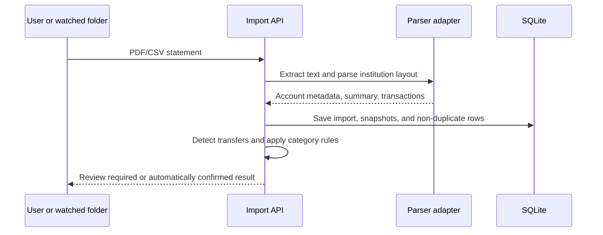
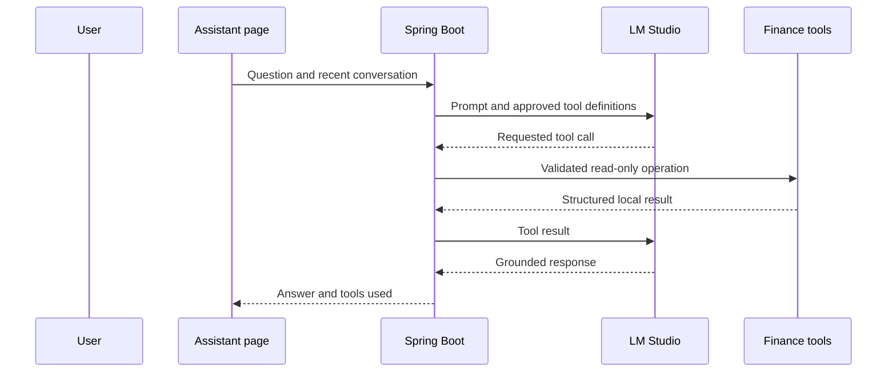

# Request Flows

## Statement import



## Assistant question



## Watched-folder automation

```text
Incoming folder scan → validate file → import pipeline
→ confident known-account import is confirmed → archive file
→ ambiguity or parsing issue remains visible for attention
```
