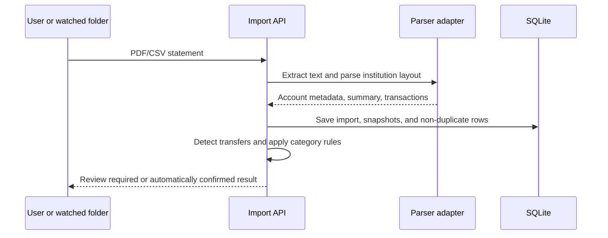
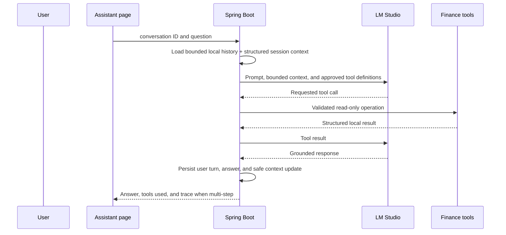
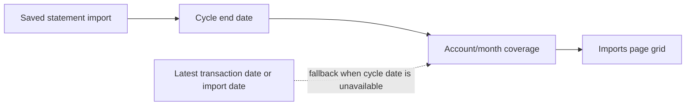

# Request Flows

## Statement import


```mermaid
sequenceDiagram
    participant U as User or watched folder
    participant API as Import API
    participant P as Parser adapter
    participant DB as SQLite
    U->>API: PDF/CSV statement
    API->>P: Extract text and parse institution layout
    P-->>API: Account metadata, summary, transactions
    API->>DB: Save import, snapshots, and non-duplicate rows
    API->>API: Detect transfers and apply category rules
    API-->>U: Review required or automatically confirmed result
```

## Assistant question


```mermaid
sequenceDiagram
    participant U as User
    participant UI as Assistant page
    participant B as Spring Boot
    participant L as LM Studio
    participant F as Finance tools
    UI->>B: conversation ID and question
    B->>B: Load bounded local history + structured session context
    B->>L: Prompt, bounded context, and approved tool definitions
    L-->>B: Requested tool call
    B->>F: Validated read-only operation
    F-->>B: Structured local result
    B->>L: Tool result
    L-->>B: Grounded response
    B->>B: Persist user turn, answer, and safe context update
    B-->>UI: Answer, tools used, and trace when multi-step
```

## Watched-folder automation

```text
Incoming folder scan → validate file → import pipeline
→ confident known-account import is confirmed → archive file
→ ambiguity or parsing issue remains visible for attention
```

A recognized statement that contains a usable account snapshot but **no transaction activity** is also confirmed and archived. For example, a zero-balance credit-card statement can still update the saved limit, available credit, APR, due date, and statement period. An unrecognized zero-row file remains in the inbox rather than being silently accepted.

## Statement coverage tracker


```mermaid
flowchart LR
    I[Saved statement import] --> P[Cycle end date]
    P --> M[Account/month coverage]
    T[Latest transaction date or import date] -.fallback when cycle date is unavailable.-> M
    M --> G[Imports page grid]
```

`GET /api/imports/coverage?year=YYYY` is a read-only local view over saved imports. It gives every saved account twelve calendar-month states:

- **Imported** — an import has a cycle-end date in that month; the most recently saved import wins when a statement was re-uploaded.
- **Missing** — a month from the account's first observed statement through the selected year's relevant end has no saved statement.
- **Not expected** — a month before the first observed statement, or a future month in the current year. This prevents the tracker from claiming the user missed a statement before the application knew the account existed.

When a parser cannot extract a statement cycle end, the tracker falls back first to the latest transaction date in that import and then to the import date. This makes coverage useful for older imports while clearly remaining an application record, rather than a claim about a bank's official statement schedule.

## Bilt activity export

Bilt's supplied CSV activity export is recognized by its transaction, posting-date, amount, and card-last-four columns. The importer preserves the raw merchant description when supplied, categorizes Bilt rent/housing charges as **Rent**, and treats Bilt housing payments as **Transfers**. The current export includes two card endings: legacy Bilt **9484**, which is preserved as the converted **Wells Fargo Autograph •9484** credit line, and the new separate **Bilt •2658** account. Rows are assigned by the exported card ending; Bilt housing payment rows use their paired housing account. CSV activity does not contain statement terms such as APR, minimum payment, or credit limit; those require a Bilt statement containing those fields.

Bilt Blue PDF statements are matched to the sole saved Bilt credit-card account when the statement does not display a card ending. The adapter extracts the statement balance, credit limit, available credit, fees, interest, minimum payment, due date, cycle dates, regular purchase APR, and a displayed new-card promotional purchase rate. If a future statement shows multiple Bilt cards but still omits the last four digits, the import is deliberately held for confirmation rather than guessed.
