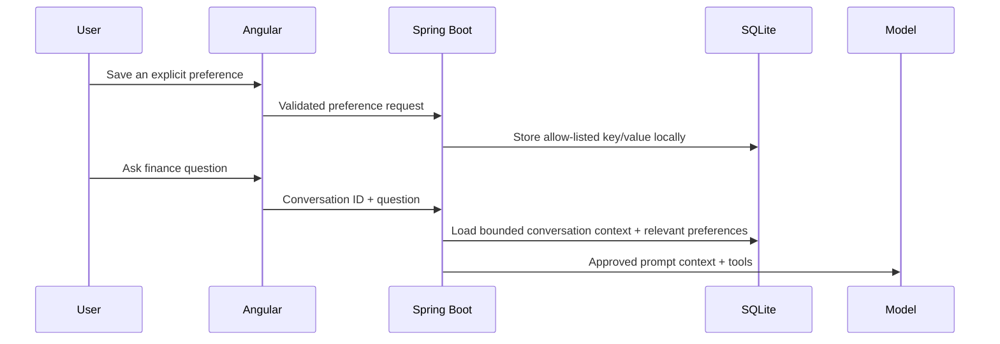

# V10 — Explicit Long-Term Memory and Preferences

**Status:** planned — begin after V4 manual verification is closed.

## Goal

Add small, durable Assistant preferences that are local, visible, editable, and deletable. V10 is not a vector database, chat-history search system, or silent personal-profile generator.

## Why this follows V9

V9 owns conversation history and short session context. V10 adds a different state type: a preference deliberately saved by the person. Financial records remain the source of truth, and chat history remains a transcript rather than a profile.

```text
Ledger data        → verified facts through read-only tools
Conversation       → bounded short-term context
Explicit preference → user-approved durable behavior setting
```

## Initial scope

- A local SQLite `assistant_preferences` table with key, value, created/updated timestamps, and a reserved future owner field.
- Angular Preferences section on the Assistant page to view, edit, and delete saved items.
- Spring Boot CRUD endpoints with a small allow-list of supported preference keys.
- Prompt assembly adds only the approved preference values relevant to the current question.
- Clear user-facing wording explaining what is remembered and how to remove it.

Examples: preferred answer detail level, a preferred monthly comparison style, or whether to show a short financial takeaway before details.

## Safety constraints

- No model-initiated writes. A person explicitly saves or edits every preference.
- No inferred facts about income, spending, family, location, health, or identity.
- No account numbers, transaction rows, statement contents, or secrets stored as preferences.
- No vector database, embeddings, semantic retrieval, or external memory service.
- V7 authentication will add user ownership checks before multi-user use is allowed.

## Implementation approach



## Definition of done

- A person can add, edit, inspect, and delete every saved preference.
- Preferences survive refresh and backend restart locally.
- The model receives only the relevant approved preference fields.
- Deleting a preference removes it from future prompt context.
- Tests cover key validation, CRUD, prompt inclusion, and deletion.
- Documentation distinguishes V10 preference memory from V9 session memory and ledger data.

## Deliberately deferred

- Automatic memory extraction by an LLM.
- Agent memory tools that write without explicit user action.
- Cross-device sync, multi-user sharing, embeddings, and RAG.
- Spring AI or LangChain4j migration; that remains the separate V6 evaluation.
