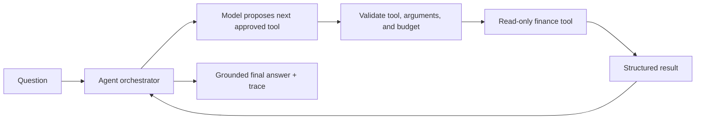
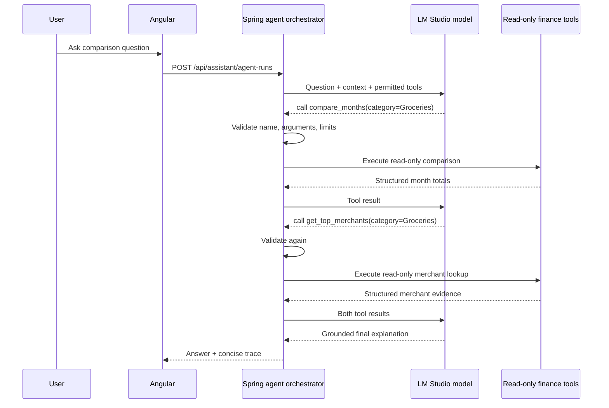
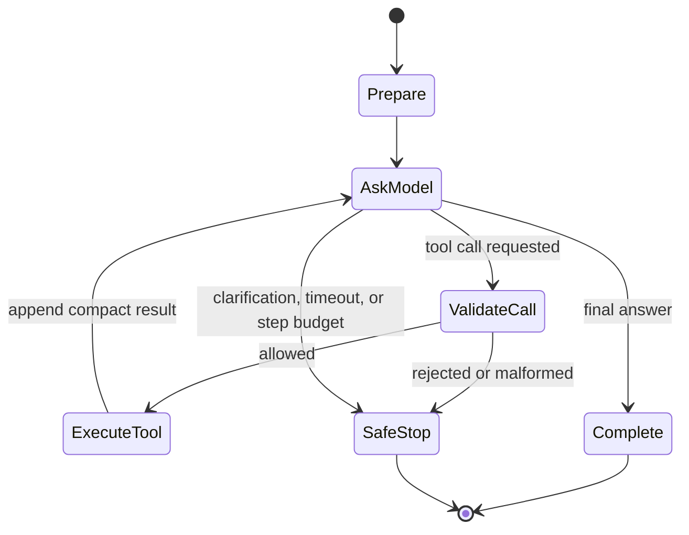

# V4 — Agentic Finance Workflows Implementation Plan

**Status:** in progress — the bounded Agent Run endpoint and opt-in UI mode are implemented; real multi-step model validation remains next.

V4 is not “give the model more permissions.” It is a controlled multi-step version of V3: the model may choose several existing read-only finance tools in sequence, under server-enforced limits, to answer questions that cannot be handled by one lookup.

## Desired experience

Examples include:

- “Why did my grocery spending increase compared with last month?”
- “Which accounts need attention before my next statement date?”
- “Compare my card utilization before and after the latest statements.”

## Architecture



The orchestrator remains a Spring Boot service. It owns the loop, not the model or an external agent framework.

## What “multi-tool calling” actually means

The local model does not receive database access and does not generate executable Java or SQL. It receives a compact list of JSON tool definitions, such as `get_category_spending`, `compare_months`, and `get_account_history`. A tool definition names the operation, explains when it is appropriate, and declares the permitted argument shape. The model can respond with either a final answer or one or more requested tool calls.

For a question such as “Why did grocery spending rise last month?”, a run may look like this:



The loop is sequential: Spring Boot asks the model what to do next, executes only a valid request, appends the result, then asks again. It stops when the model gives a final answer or the run reaches a safety boundary. The model is useful because it chooses the order of tools and turns their results into a readable explanation; the deterministic tools remain necessary because they make financial calculations correct and inspectable.

## Agent data contract

The initial Java records should make every step explicit:

```text
AgentRunRequest(question, sessionContext)
ToolDefinition(name, description, JSON argument schema)
RequestedToolCall(callId, name, arguments)
AgentStep(index, requestedTool, validatedArguments, outcome, duration)
AgentRunResponse(answer, evidence, steps, stopReason)
```

`ToolDefinition` objects are created in backend code, not by the model. The validation layer rejects an unknown name, missing/extra arguments, invalid dates, an over-wide date range, or a result that exceeds the response-size budget. Tool results are compact typed objects, not unrestricted transaction dumps.

## Implementation phases

### 1. Define a bounded agent contract

- Add `AgentRunRequest`, `AgentStep`, and `AgentRunResponse` records.
- Keep the existing V3 tool catalog; do not add write tools.
- Enforce a maximum of three tool rounds and a maximum total tool-result size.
- Require a final answer or a clear clarification request before the budget is exhausted.

### 2. Implement the orchestration loop

1. Send the system prompt, recent session context, tool catalog, and user question to LM Studio.
2. Validate every requested tool name and JSON argument using the current allow-list.
3. Execute only read-only tool calls.
4. Add compact tool results to the conversation and request the next model action.
5. Stop at a final answer, a clarification, a safety failure, or the step budget.

The first V4 version should remain sequential. Parallel tool execution is an optimization only after correctness and traceability are proven.

### 2a. Implement explicit run states



`Prepare` resolves the session context and starts a per-run timeout. `ValidateCall` is deterministic Java code. `ExecuteTool` runs inside the established read-only finance-service boundary. `SafeStop` produces a user-facing explanation such as “I need a date range” or “The local model did not finish in time,” never a partial invented answer.

### 3. Make the run inspectable

Return a user-friendly trace with the final answer: tools used, resolved period, number of steps, and whether the budget ended the run. Do not expose raw prompts, internal stack traces, or excessive financial rows.

### 4. Add explicit safety controls

- Allow-listed tools only; no SQL, shell, HTTP, filesystem, or mutation tools.
- Per-tool argument validation and date-range limits.
- Maximum three steps, timeout budget, and response-size limits.
- Deterministic fallback for the narrow V3 questions already supported.
- A safe “I need a date range/account clarification” result when information is ambiguous.

### 5. Evaluate before expanding scope

Create a repeatable evaluation set with expected tool sequence and financial semantics. Cover successful multi-step comparisons, ambiguous questions, unavailable LM Studio, malformed calls, and step-budget exhaustion. Record model name and pass/fail outcome locally; never commit private financial answers.

## Proposed implementation sequence

1. **Complete:** Add the `AgentRunRequest`, `AgentStep`, and `AgentRunResponse` records plus `/api/assistant/agent-runs`, without changing the V3 Assistant route. The Angular Assistant now has an opt-in **Agent Run** mode that renders the tool-step trace.
2. Implement a three-round sequential orchestrator using the existing LM Studio `RestClient` integration.
3. Add argument schemas and tests for unknown tools, invalid arguments, and date/size/timeout limits.
4. Expose a separate Angular “Agent run” experience that shows the final answer and human-readable tool trace.
5. Build a local evaluation fixture set using synthetic transactions, then validate a few real questions without committing their answers.

This makes V4 a deliberate evolution of V3 rather than an opaque agent framework integration. Spring AI remains optional: it may reduce provider-specific request code later, but it does not replace the validation, safety policy, financial tool implementations, or evaluation work above.

## Technology choice

Continue with Spring Boot `RestClient` and Jackson for the first V4 loop. This keeps tool validation, request construction, and tracing transparent. Spring AI can be evaluated later if multiple providers or more advanced abstractions become necessary, but it is not required to build a safe first agent.

## Definition of done

V4 is complete only when multi-step questions produce grounded answers with a visible trace, remain fully read-only/local-first, respect all budgets, and pass the evaluation suite with the selected local model.
