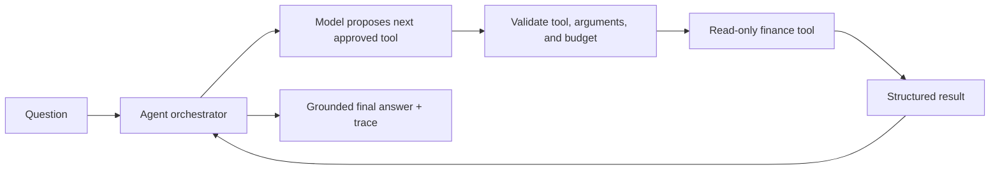

# V4 — Agentic Finance Workflows Implementation Plan

**Status:** planned; do not begin until V3 real-question validation is complete.

V4 is not “give the model more permissions.” It is a controlled multi-step version of V3: the model may choose several existing read-only finance tools in sequence, under server-enforced limits, to answer questions that cannot be handled by one lookup.

## Desired experience

Examples include:

- “Why did my grocery spending increase compared with last month?”
- “Which accounts need attention before my next statement date?”
- “Compare my card utilization before and after the latest statements.”

## Architecture

The orchestrator remains a Spring Boot service. It owns the loop, not the model or an external agent framework.

## Implementation phases

### 1. Define a bounded agent contract

- Add `AgentRunRequest`, `AgentStep`, and `AgentRunResponse` records.
- Keep the existing V3 tool catalog; do not add write tools.
- Enforce a maximum of three tool rounds and a maximum total tool-result size.
- Require a final answer or a clear clarification request before the budget is exhausted.

### 2. Implement the orchestration loop

1. Send the system prompt, recent session context, tool catalog, and user question to LM Studio.
2. Validate every requested tool name and JSON argument using the current allow-list.
3. Execute only read-only tool calls.
4. Add compact tool results to the conversation and request the next model action.
5. Stop at a final answer, a clarification, a safety failure, or the step budget.

The first V4 version should remain sequential. Parallel tool execution is an optimization only after correctness and traceability are proven.

### 3. Make the run inspectable

Return a user-friendly trace with the final answer: tools used, resolved period, number of steps, and whether the budget ended the run. Do not expose raw prompts, internal stack traces, or excessive financial rows.

### 4. Add explicit safety controls

- Allow-listed tools only; no SQL, shell, HTTP, filesystem, or mutation tools.
- Per-tool argument validation and date-range limits.
- Maximum three steps, timeout budget, and response-size limits.
- Deterministic fallback for the narrow V3 questions already supported.
- A safe “I need a date range/account clarification” result when information is ambiguous.

### 5. Evaluate before expanding scope

Create a repeatable evaluation set with expected tool sequence and financial semantics. Cover successful multi-step comparisons, ambiguous questions, unavailable LM Studio, malformed calls, and step-budget exhaustion. Record model name and pass/fail outcome locally; never commit private financial answers.

## Technology choice

Continue with Spring Boot `RestClient` and Jackson for the first V4 loop. This keeps tool validation, request construction, and tracing transparent. Spring AI can be evaluated later if multiple providers or more advanced abstractions become necessary, but it is not required to build a safe first agent.

## Definition of done

V4 is complete only when multi-step questions produce grounded answers with a visible trace, remain fully read-only/local-first, respect all budgets, and pass the evaluation suite with the selected local model.
