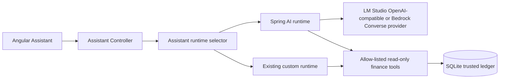
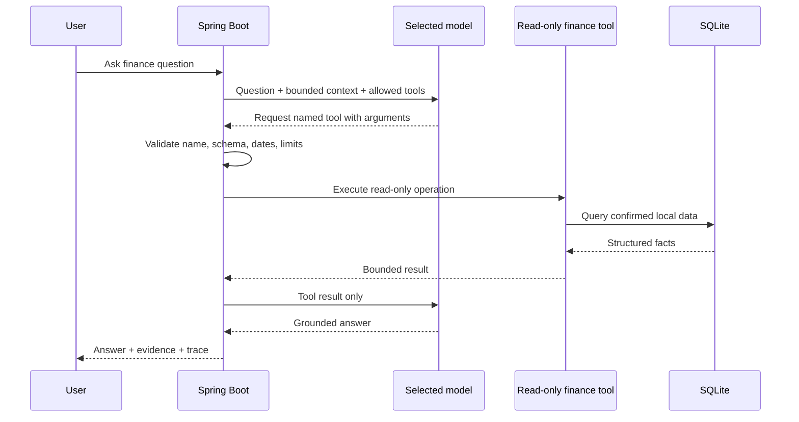
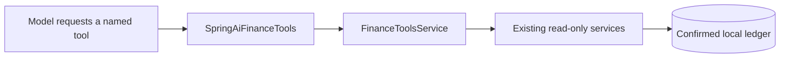

# V6 — Spring AI Integration and Cloud Provider Boundary

**Status:** in progress  
**Tracking:** GitHub Issue #19

## Goal

Move the Assistant's model integration from handwritten OpenAI-shaped HTTP payloads toward Spring AI while preserving the application guarantees already established in V3/V4:

- finance data remains local by default;
- every model-visible finance fact comes from a read-only, allow-listed application tool;
- the model never receives database access or arbitrary SQL;
- local LM Studio remains a supported option;
- cloud use is explicitly selected and sends only the question, bounded chat context, tool definitions, and tool results needed for that answer.

V6 is an integration modernization, not permission expansion. It does not add write-capable tools or make payments.

## Why Spring AI

Spring AI is selected over LangChain4j because this is already a Spring Boot service. It offers Spring-native `ChatClient`, `@Tool` support, provider abstraction, tool-calling control, and Bedrock Converse support. The project will use the Spring AI **1.1.x** line while it remains on Spring Boot 3.5; Spring AI 2.x targets Spring Boot 4.

## Target architecture

The runtime selector is a temporary migration seam. It allows parity testing and immediate rollback without changing the API consumed by Angular.

## Delivery phases

1. **Foundation — current**
   - Import Spring AI dependency management.
   - Keep all Spring AI model auto-configuration disabled by default.
   - Document the scope, security boundary, provider strategy, and rollback plan.

2. **Tool facade — complete**
   - Expose a separate Spring AI `@Tool` facade over `FinanceToolsService`.
   - Preserve bounded inputs, result-size limits, confirmed-transaction filtering, and calculation logic.
   - Do not expose repositories, SQL, import operations, filesystem operations, or write methods.
   - `SpringAiFinanceTools` exposes the same eleven named read-only operations already approved for the Assistant. It delegates every call to `FinanceToolsService`, so the established filtering, calculation, and size-limit behavior remains the single implementation of record.

3. **Local-provider parity path**
   - Add an opt-in Spring AI OpenAI-compatible configuration for LM Studio.
   - Route a selected test mode through `ChatClient` and compare the response, tool trace, and evidence against the existing evaluation suite.

4. **Bedrock provider path**
   - Add an explicit Spring AI Bedrock Converse profile using the local AWS credential chain.
   - Preserve the current minimum-data contract and timeout/budget configuration.
   - Run real-provider verification before allowing it as the default cloud path.

5. **Promotion or rollback**
   - Promote Spring AI only when V4 evaluation prompts, safety checks, and trace/evidence output are at parity.
   - Keep the custom runtime available behind configuration until the migration is proven stable.

## Safety contract

Spring AI simplifies provider and tool-call plumbing; it does not replace application validation, tool limits, evidence, audit traces, or trusted calculations.

## Tool façade boundary

The Spring AI façade is intentionally a thin adapter, not a second finance domain layer:

It publishes these eleven operations: monthly summary, category spending, merchant spending, recurring activity, account overview, account history, period comparison, category comparison, credit utilization, credit paydown planning, and bounded transaction search. The façade has no repository dependency and exposes no import, file, SQL, payment, or other write operation.

## Configuration and privacy

- `finance.assistant.provider` remains the active runtime/provider switch today.
- Spring AI dependencies are present but its model auto-configuration is disabled by default during the foundation phase.
- No API key is committed or stored in SQLite.
- When cloud mode is later enabled, the database and raw statement files remain local. The model receives only a question, selected bounded context, tool definitions, and the individual tool results needed to answer.

## Definition of done

- The same public Assistant API works through the Spring AI runtime.
- Local OpenAI-compatible and Bedrock Converse paths are explicitly configurable.
- Every existing approved tool has a mapped, read-only Spring AI tool callback.
- Existing synthetic tests and the V4 real-provider checklist pass with equivalent evidence and trace output.
- Provider failure, tool validation, timeout, and privacy behavior remain documented and tested.
