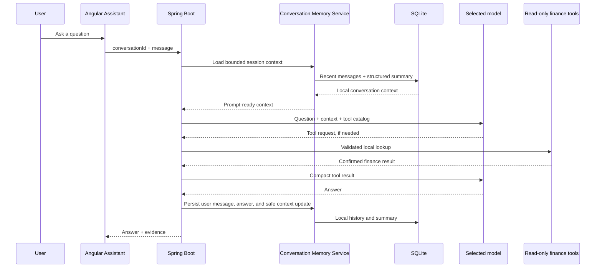

# V9 — Persistent Agent Memory

**Status:** in progress — the local persistence slice now includes SQLite conversation tables, backend-owned IDs, bounded recent-message loading, structured session context, Assistant UI controls, and focused service/controller tests. The remaining validation is a live local API check after the backend is restarted with migration `V18`.

## Goal

Make an Assistant conversation survive a browser refresh and let safe follow-up questions retain their context without treating a model's past answer as financial truth.

For example, after asking “How much did I spend at Patel Brothers in July?”, a later “What about August?” should retain the merchant and resolve the new month without the person repeating the full question.

## Current behavior

The Angular Assistant page currently holds the visible transcript only in browser memory. On each request it sends its newest 12 user/assistant messages to Spring Boot. The page refreshes to an empty conversation, and messages older than the 12-message window are not sent to the model.

This is a useful prototype, but it is neither durable session memory nor long-term user memory.

## Definitions

| Term | Meaning in this application |
|---|---|
| Chat history | The complete visible transcript a person can review or delete. |
| Session memory | A compact, bounded context used to answer the next question in the same conversation. |
| Long-term memory | Explicitly saved preferences or facts, such as “prefer monthly comparisons.” It is never inferred silently from financial data. |
| Finance data | Confirmed transactions, accounts, statement snapshots, and category rules in SQLite. This remains the source of truth. |

## Ownership and identifiers

`conversationId` is an opaque identifier generated by **Spring Boot** when a conversation is created. The model does not create it, choose it, receive authority through it, or tell the application how to store memory.

Initially, Spring Boot will generate a random UUID, store the conversation locally, and return the ID to Angular. Angular keeps that opaque ID and sends it with later messages. When V7 authentication exists, every read and write will additionally be constrained by the authenticated `userId`; a valid conversation ID alone will never grant access to another person's history.

## Target architecture


```mermaid
sequenceDiagram
    participant U as User
    participant UI as Angular Assistant
    participant API as Spring Boot
    participant MEM as Conversation Memory Service
    participant DB as SQLite
    participant LLM as Selected model
    participant TOOLS as Read-only finance tools

    U->>UI: Ask a question
    UI->>API: conversationId + message
    API->>MEM: Load bounded session context
    MEM->>DB: Recent messages + structured summary
    DB-->>MEM: Local conversation context
    MEM-->>API: Prompt-ready context
    API->>LLM: Question + context + tool catalog
    LLM-->>API: Tool request, if needed
    API->>TOOLS: Validated local lookup
    TOOLS-->>API: Confirmed finance result
    API->>LLM: Compact tool result
    LLM-->>API: Answer
    API->>MEM: Persist user message, answer, and safe context update
    MEM->>DB: Local history and summary
    API-->>UI: Answer + evidence
```

The model continues to see only the bounded prompt context and the exact tool result needed for the current answer. It never reads the database directly.

## Proposed implementation

### 1. Backend-owned conversation service

Add a `ConversationService` responsible for creating conversations, appending messages, loading history, building prompt context, and deleting a conversation. `LocalAssistantService` remains responsible for tool orchestration; it should not become a persistence service.

### 2. SQLite persistence

Add local tables equivalent to:

```text
assistant_conversations
  id, created_at, last_active_at, title, owner_id (reserved for V7)

assistant_messages
  id, conversation_id, sequence_number, role, content, created_at,
  execution_mode, tools_used, evidence

assistant_memory_summaries
  conversation_id, summary_version, structured_context, updated_at
```

`structured_context` is deliberately small and machine-readable: the most recent explicit date range, merchant, account, category, and unresolved user question. It is not an unbounded model-written biography.

### 3. Bounded prompt assembly

For every message, Spring Boot should assemble:

1. System safety instructions.
2. The current structured session context.
3. The newest token-bounded message window.
4. The new user question.
5. Tool results only within the current agent run.

Older messages remain available in the transcript but are not automatically sent to the model. When the window must shrink, the backend retains explicit context fields rather than silently inventing a prose summary. This controls latency, cloud cost, and accidental disclosure.

### 4. UI behavior

The Angular page should create a conversation on first use, restore the latest local conversation after refresh, offer **New conversation**, and offer a clear deletion action. It should show only user-facing history, never internal system prompts or raw tool payloads.

### 5. Long-term memory is opt-in

V9 does not automatically create durable personal facts from messages. If a later feature adds preferences, it must show the user what will be remembered, provide edit/delete controls, and keep those preferences separate from chat history and ledger data.

## Privacy and retention

- Conversation history remains in the local SQLite database by default.
- No transcript, statement, or tool result is committed to Git.
- Cloud-model use follows the existing minimum-necessary-data policy: the provider receives only the current bounded context, question, tool definitions, and compact tool results.
- Deleting a conversation removes its messages and session summary locally.
- V7 authentication must add ownership checks before multi-user persistence is enabled.

## Correctness rule for remembered merchant follow-ups

When a person asks for spending at one named merchant, including a follow-up such as “What about August?”, Spring Boot resolves the remembered merchant and date range, then calculates the amount from date-filtered confirmed transaction rows. It does not use the aggregate **Top merchants** lookup for this question type. This prevents a model from mistaking a period-wide top-merchant total for the requested merchant’s total.

## Spring AI and LangChain4j assessment

Both libraries can reduce plumbing for a sliding message window and persistent memory store. Spring AI offers chat-memory advisors; LangChain4j offers `ChatMemory`, window policies, and a persistent-store extension point. They are implementation options, not the architecture itself.

The V9 implementation should first define the project-owned conversation schema, retention policy, ownership model, and prompt boundaries. A later V6 library migration can adapt that schema to Spring AI or LangChain4j without allowing a framework to determine financial-data access or privacy behavior.

## Industry and open-source reference implementations

V9 follows established application architecture rather than treating an LLM as a database. The projects below are public, production-oriented references for distinct parts of the design. They are learning references, not dependencies and not code to copy wholesale.

| Reference | What it demonstrates | V9 adoption | Deliberately deferred |
| --- | --- | --- | --- |
| [Open WebUI memory](https://docs.openwebui.com/features/chat-conversations/memory/) ([source](https://github.com/open-webui/open-webui)) | Self-hosted, user-scoped persisted memories; user edit/delete controls; bounded prompt-injection budgets; optional model-managed memory actions. | Local SQLite persistence, bounded context, and clear user controls. | Automatic background memory extraction and model-directed writes. |
| [Letta memory architecture](https://github.com/letta-ai/skills/blob/main/letta/agent-development/references/memory-architecture.md) ([source](https://github.com/letta-ai/letta)) | A clear split between recent conversation context, durable core memory, and searchable archival memory. | Separate transcript, compact session context, and future explicit preferences. | Vector/archival retrieval and agent-managed memory blocks. |
| [LibreChat user memory](https://www.librechat.ai/docs/features/memory) ([source](https://github.com/danny-avila/LibreChat)) | User- and agent-scoped memory partitions, memory tools, configurable context windows, and deployment-level access controls. | The future ownership boundary and explicit preference-memory tools. | Multi-user partitions and authorization until V7 authentication. |

### Interview-ready architecture mapping

| This tracker now | Scaled production equivalent | Why the separation matters |
| --- | --- | --- |
| SQLite conversation tables | Managed relational or document persistence | The application, not the model, owns lifecycle, deletion, and access control. |
| Recent message window plus `structured_context` | Token-aware context management and summarization/compaction pipeline | Keeps latency, cloud cost, and accidental data exposure bounded. |
| Confirmed ledger queried through read-only tools | Operational source systems behind least-privilege APIs | A model answer is grounded in current verified data rather than recalled text. |
| Future explicit `assistant_preferences` | User-scoped durable personalization store | Personalization is visible, editable, and distinct from financial truth. |
| V4 tool traces and answer evidence | Observability, audit trail, and evaluation telemetry | A person can inspect which verified data supported an answer. |

In an interview, this can be described as a **stateful application around a stateless LLM**: Spring Boot owns durable state and policy; the model receives only bounded context and allow-listed read-only tools; SQLite financial records remain the authoritative ledger.

## Acceptance criteria

- A backend-generated conversation survives a browser refresh.
- A later follow-up can use the saved merchant/date/category context correctly.
- The model receives a bounded window and structured context, not an unlimited transcript.
- A person can start and delete a local conversation.
- Conversation records are local-only and excluded from Git.
- Existing read-only tool validation, evidence, and agent limits remain unchanged.
- Tests cover conversation isolation, window trimming, refresh restoration, deletion, and follow-up context resolution.

## Verification completed

- `ConversationServiceTest` verifies the newest-12-message prompt window, saved follow-up context, transcript metadata restoration, and child-record deletion before conversation deletion.
- `AssistantControllerTest` verifies conversation creation/restoration routes and a server-loaded prompt context for a saved turn.
- The Angular production build verifies the Assistant page’s refresh, new-conversation, and deliberate-delete controls compile successfully.

The remaining live check is intentionally small and does not require a cloud or local model: create a conversation, retrieve it, delete it, and confirm that a later retrieval returns `404`. A model-backed follow-up check can then confirm that “What about August?” retains an earlier merchant context.

## Out of scope

- Cross-device sync.
- Multi-user access before V7 authentication and user isolation.
- Vector databases, embeddings, or RAG for chat transcripts.
- Automatically inferred long-term personal preferences.
- Any tool that writes transactions, categories, accounts, or money movement.
